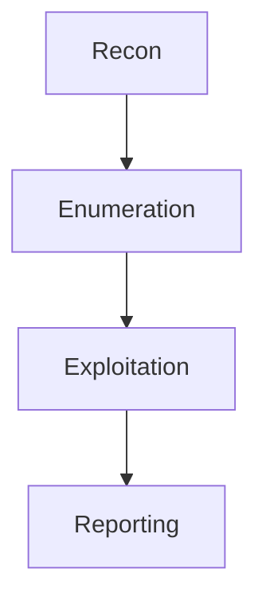

# Render Test

This page is temporary. It is only here to test how different Markdown elements render in the theme.

---

## Text Styling

Normal paragraph text should be readable and not too heavy.

**Bold text** should stand out without looking oversized.

*Italic text* should remain readable.

~~Strikethrough text~~ should look subtle.

A normal cybersecurity sentence with inline code: use `nmap -sC -sV`, `curl -I`, and `whoami /priv` during authorized testing only.

---

## Links

Internal link example: [Home](index.md)

External link example: [OWASP](https://owasp.org)

---

## Headings

# H1 Heading Test

## H2 Heading Test

### H3 Heading Test

#### H4 Heading Test

##### H5 Heading Test

###### H6 Heading Test

---

## Bullet Lists

- Reconnaissance
- Enumeration
- Exploitation
- Post-exploitation
- Reporting

### Nested Bullet Lists

- Web testing
  - Content discovery
  - Authentication testing
  - Access control testing
- Network testing
  - Port scanning
  - Service enumeration
  - Vulnerability validation

---

## Numbered Lists

1. Define scope
2. Confirm authorization
3. Perform reconnaissance
4. Document findings
5. Recommend remediation

---

## Task Lists

- [x] Create MkDocs site
- [x] Add custom theme
- [ ] Import notes
- [ ] Publish with GitHub Pages

---

## Blockquote

> Good notes should explain what was tested, why it mattered, what was observed, and how the issue can be fixed.

---

## Inline Keyboard / Technical Text

Press `Ctrl + C` to stop `mkdocs serve`.

Use `ipconfig`, `Get-NetIPAddress`, or `ip a` depending on the operating system.

---

## Bash Code Block

```bash
#!/usr/bin/env bash

TARGET="10.10.10.10"

mkdir -p scans

nmap -sC -sV -oA scans/initial "$TARGET"
gobuster dir \
  -u "http://$TARGET" \
  -w /usr/share/wordlists/dirb/common.txt \
  -o scans/gobuster.txt
```

---

## PowerShell Code Block

```powershell
$Target = "example.com"

Resolve-DnsName $Target
Test-NetConnection $Target -Port 443
Get-NetIPAddress | Select-Object InterfaceAlias,IPAddress,AddressFamily
```

---

## Python Code Block

```python
import requests

url = "http://example.local"

try:
    response = requests.get(url, timeout=5)
    print(f"Status: {response.status_code}")
    print(f"Server: {response.headers.get('Server', 'Unknown')}")
except requests.RequestException as error:
    print(f"Request failed: {error}")
```

---

## JSON Code Block

```json
{
  "finding": "Missing security headers",
  "severity": "Low",
  "recommendation": "Add common browser security headers."
}
```

---

## YAML Code Block

```yaml
site_name: Security Fieldbook
theme:
  name: material
  palette:
    - scheme: slate
      primary: black
      accent: amber
```

---

## HTTP Request Block

```http
GET /admin HTTP/1.1
Host: example.local
User-Agent: SecurityFieldbook/1.0
Accept: */*
```

---

## Long Code Line Test

```bash
ffuf -u http://example.local/FUZZ -w /usr/share/seclists/Discovery/Web-Content/raft-medium-directories.txt -mc all -fc 404 -recursion -recursion-depth 2 -o scans/ffuf-long-output-example.json
```

---

## Table

| Severity | Finding | Impact | Recommendation |
|---|---|---|---|
| Low | Missing security headers | Reduced browser-side protection | Add common defensive headers |
| Medium | Directory listing enabled | Sensitive files may be exposed | Disable indexing |
| High | Weak credentials | Unauthorized access possible | Enforce strong passwords and MFA |
| Critical | Remote code execution | Full system compromise possible | Patch immediately and restrict access |

---

## Wide Table Test

| Tool | Purpose | Example Command | Notes |
|---|---|---|---|
| Nmap | Service enumeration | `nmap -sC -sV 10.10.10.10` | Good first scan |
| Gobuster | Content discovery | `gobuster dir -u http://target -w wordlist.txt` | Useful for hidden paths |
| SQLMap | SQL injection testing | `sqlmap -u "http://target/item?id=1" --batch` | Only use with permission |
| Wireshark | Packet analysis | GUI-based | Useful for traffic inspection |
| Splunk | Log analysis | `index=* sourcetype=WinEventLog` | SOC-focused |

---

## Admonitions

!!! note
    This is a note block. It should look calm and readable.

!!! tip
    Use checklists to make repeatable workflows easier.

!!! warning
    Never test systems without written permission.

!!! danger
    Credentials, tokens, private keys, and real customer data should never be published.

!!! info
    Use lab IPs, sanitized examples, and fictional targets in public notes.

---

## Collapsible Details

??? note "Click to expand methodology notes"
    1. Confirm authorization.
    2. Define the target scope.
    3. Record timestamps and commands.
    4. Validate findings safely.
    5. Write remediation steps.

??? warning "Sensitive note example"
    This is where private details would normally go, but public notes should avoid secrets and real target data.

---

## Tabs

=== "Bash"

    ```bash
    whoami
    id
    uname -a
    ```

=== "PowerShell"

    ```powershell
    whoami
    hostname
    Get-ComputerInfo
    ```

=== "Python"

    ```python
    import platform
    print(platform.platform())
    ```

---

## Definition List Style Test

**Reconnaissance**  
: Collecting information about a target before deeper testing.

**Enumeration**  
: Actively identifying services, users, shares, versions, and exposed functionality.

**Remediation**  
: The recommended fix or mitigation for a security issue.

---

## Image Placeholder

Use this later to test screenshots:

```markdown

```

---

## Mermaid-Style Text Test

MkDocs will not render Mermaid diagrams unless we add Mermaid support later.



---

## Footnote Test

A clear portfolio should separate notes, labs, and writeups.[^1]

[^1]: This is a test footnote.

---

## Final Checklist

- [ ] Headings look good
- [ ] Code blocks are readable
- [ ] Long commands scroll or wrap nicely
- [ ] Tables are readable
- [ ] Admonitions match the theme
- [ ] Tabs work correctly
- [ ] Light mode is acceptable
- [ ] Dark mode feels close to Obsidian